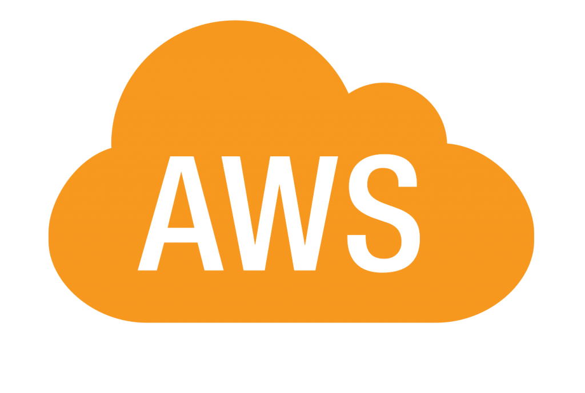

	
	<h1 style="font-size: 5em; font-weight: 400">+</h1>
	

# Effect for AWS Lambda

and other AWS services

---

#### In this talk

- Introduction and motivation
- Running AWS lambda handler within Effect runtime
- Effectful AWS SDK clients common implementation
- Future of **effect-aws**

---

<grid drag="30 100" drop="left">
Who am I?

<B>Victor Korzunin</B>

 /F1oydRose

 /floydspace

 /victor.korzunin

</grid>
<grid drag="65 100" drop="right">
- Software Engineer, 9+ years of experience

  - 8+ years with TypeScript
  - 6+ years with Serverless and AWS

- Open-Source Contributor

  - Author of [effect-aws](https://github.com/floydspace/effect-aws)
  - Author of [effect-kafka](https://github.com/floydspace/effect-kafka)
  - Author of [serverless-esbuild](https://github.com/floydspace/serverless-esbuild) plugin

- Ex- professional day-trader
</grid>

notes:
- based in rotterdam
- english, presenter, bare with me

---
<!-- slide bg="[[icebreaker.jpg]]" data-background-opacity="0.5" -->
#### How many of you work with AWS?

notes:
- how important it is

---
<!-- slide bg="[[motivation.jpg]]" data-background-opacity="0.8" data-background-size="50% 100%" data-background-position="right center" -->

<grid drag="60 100" drop="-50 0">
#### Motivation

- Having the **common implementation**, to not repeat myself when working with AWS lambda and Effect
- Having the **seamless migration** experience from classic AWS Lambda implementation to the Effectful one.
</grid>

notes:
I work a lot with lambda and started many serverless projects, so I collected some common patterns a logic which I prefer to use, and when I started working with Effect I noticed that doing he same job again and again, it is why I decided to extract common logic to a package.

Serverless development lifecycle is sometimes more complex, you have to deploy to the cloud to see actual behaviour one or another aws service, with type safety not only on input and result, but also on error level helps to reduce repetition of deployment and testing in runtime.

It actually applies not only yo effect-aws, but to the effect itself, bc it provides a lot of helpful functions to make your code better without overthinking a spending too much time, Effect team does it for you.

---

<!-- .slide: data-auto-animate -->

Classic lambda example

<pre data-id="code-animation"><code data-trim data-line-numbers="6-19|1,6-9|10|2-4,12-14|12,16|13,17|14,18|21|6-19">
import type { Handler, SNSEvent } from "aws-lambda";
import { SNSEventBus } from "./bus";
import { YahooQuoteClient } from "./quoteClient";
import { MongoDbInstrumentStore } from "./store";

const handler: Handler&lt;
  SNSEvent,
  void
&gt; = async (event) => {
  const { symbol } = JSON.parse(event.Records[0].Sns.Message);

  const client = new YahooQuoteClient();
  const store = await MongoDbInstrumentStore.init();
  const bus = new SNSEventBus();

  const quote = await client.lastPrice(symbol);
  await store.updateQuote(symbol, quote);
  await bus.publish("quote_updated", { symbol, quote });
};

module.exports.handler = handler;
&nbsp;
</code></pre>
notes:
- I want to start with **@effect-aws/lambda** package

---

<!-- .slide: data-auto-animate -->

Effect lambda example

<pre data-id="code-animation"><code data-trim data-line-numbers="1,8-13">
import { EffectHandler } from "@effect-aws/lambda";
import type { SNSEvent } from "aws-lambda";
import { Effect, Layer } from "effect";
import { SNSEventBus } from "./bus";
import { YahooQuoteClient } from "./quoteClient";
import { MongoDbInstrumentStore } from "./store";

const effectHandler: EffectHandler&lt;
  SNSEvent,
  EventBus | QuoteClient | InstrumentStore,
  never,
  void
&gt; = async (event) => {
  const { symbol } = JSON.parse(event.Records[0].Sns.Message);

  const client = new YahooQuoteClient();
  const store = await MongoDbInstrumentStore.init();
  const bus = new SNSEventBus();

  const quote = await client.lastPrice(symbol);
  await store.updateQuote(symbol, quote);
  await bus.publish("quote_updated", { symbol, quote });
};

module.exports.handler = handler;
&nbsp;
</code></pre>
notes:
- I want to start with **@effect-aws/lambda** package

---

<!-- .slide: data-auto-animate -->

Effect lambda example

<pre data-id="code-animation"><code data-trim data-line-numbers="8-13,23">
import { EffectHandler } from "@effect-aws/lambda";
import type { SNSEvent } from "aws-lambda";
import { Effect, Layer } from "effect";
import { SNSEventBus } from "./bus";
import { YahooQuoteClient } from "./quoteClient";
import { MongoDbInstrumentStore } from "./store";

const effectHandler: EffectHandler&lt;
  SNSEvent,
  EventBus | QuoteClient | InstrumentStore,
  never,
  void
&gt; = (event) => Effect.gen(function* () {
  const { symbol } = JSON.parse(event.Records[0].Sns.Message);

  const client = new YahooQuoteClient();
  const store = await MongoDbInstrumentStore.init();
  const bus = new SNSEventBus();

  const quote = await client.lastPrice(symbol);
  await store.updateQuote(symbol, quote);
  await bus.publish("quote_updated", { symbol, quote });
}).pipe(Effect.orDie);

module.exports.handler = handler;
&nbsp;
</code></pre>
notes:
- I want to start with **@effect-aws/lambda** package

---

<!-- .slide: data-auto-animate -->

Effect lambda example

<pre data-id="code-animation"><code data-trim data-line-numbers="4-6,16-18|4-6,20-22|8-23">
import { EffectHandler } from "@effect-aws/lambda";
import type { SNSEvent } from "aws-lambda";
import { Effect, Layer } from "effect";
import { EventBus, SNSEventBusLive } from "./bus";
import { QuoteClient, YahooQuoteClientLive } from "./quoteClient";
import { InstrumentStore, MongoDbInstrumentStoreLive } from "./store";

const effectHandler: EffectHandler&lt;
  SNSEvent,
  EventBus | QuoteClient | InstrumentStore,
  never,
  void
&gt; = (event) => Effect.gen(function* () {
  const { symbol } = JSON.parse(event.Records[0].Sns.Message);

  const client = yield* QuoteClient;
  const store = yield* InstrumentStore;
  const bus = yield* EventBus;

  const quote = yield* client.lastPrice(symbol);
  yield* store.updateQuote(symbol, quote);
  yield* bus.publish("quote_updated", { symbol, quote });
}).pipe(Effect.orDie);

module.exports.handler = handler;
&nbsp;
</code></pre>
notes:
- I want to start with **@effect-aws/lambda** package

---

<!-- .slide: data-auto-animate -->

Effect lambda example

<pre data-id="code-animation"><code data-trim data-line-numbers="1,25">
import { EffectHandler, makeLambda } from "@effect-aws/lambda";
import type { SNSEvent } from "aws-lambda";
import { Effect, Layer } from "effect";
import { EventBus, SNSEventBusLive } from "./bus";
import { QuoteClient, YahooQuoteClientLive } from "./quoteClient";
import { InstrumentStore, MongoDbInstrumentStoreLive } from "./store";

const effectHandler: EffectHandler&lt;
  SNSEvent,
  EventBus | QuoteClient | InstrumentStore,
  never,
  void
&gt; = (event) => Effect.gen(function* () {
  const { symbol } = JSON.parse(event.Records[0].Sns.Message);

  const client = yield* QuoteClient;
  const store = yield* InstrumentStore;
  const bus = yield* EventBus;

  const quote = yield* client.lastPrice(symbol);
  yield* store.updateQuote(symbol, quote);
  yield* bus.publish("quote_updated", { symbol, quote });
}).pipe(Effect.orDie);

module.exports.handler = makeLambda(effectHandler);
&nbsp; 
</code></pre>
notes:
- I want to start with **@effect-aws/lambda** package

---

<!-- .slide: data-auto-animate -->

Effect lambda example

<pre data-id="code-animation"><code data-trim data-line-numbers="25-32">
import { EffectHandler, makeLambda } from "@effect-aws/lambda";
import type { SNSEvent } from "aws-lambda";
import { Effect, Layer } from "effect";
import { EventBus, SNSEventBusLive } from "./bus";
import { QuoteClient, YahooQuoteClientLive } from "./quoteClient";
import { InstrumentStore, MongoDbInstrumentStoreLive } from "./store";

const effectHandler: EffectHandler&lt;
  SNSEvent,
  EventBus | QuoteClient | InstrumentStore,
  never,
  void
&gt; = (event) => Effect.gen(function* () {
  const { symbol } = JSON.parse(event.Records[0].Sns.Message);

  const client = yield* QuoteClient;
  const store = yield* InstrumentStore;
  const bus = yield* EventBus;

  const quote = yield* client.lastPrice(symbol);
  yield* store.updateQuote(symbol, quote);
  yield* bus.publish("quote_updated", { symbol, quote });
}).pipe(Effect.orDie);

module.exports.handler = makeLambda({
  handler: effectHandler,
  layer: Layer.mergeAll(
    SNSEventBusLive,
    YahooQuoteClientLive,
    MongoDbInstrumentStoreLive
  ),
});
&nbsp;
</code></pre>

note:
- makeLambda adapter
- optional global layer
- local layer can be used

---

<!-- .slide: data-auto-animate -->

Lambda handler

<pre data-id="code-animation2"><code data-trim class="language-ts">
// Callback way
type Handler&lt;T = unknown, A = any&gt; = (
  event: T,
  context: Context,
  callback: Callback&lt;A&gt;,
) =&gt; void
</code></pre>

---

<!-- .slide: data-auto-animate -->

Lambda handler

<pre data-id="code-animation2"><code data-trim class="language-ts">
// Callback way
type Handler&lt;T = unknown, A = any&gt; = (
  event: T,
  context: Context,
  callback: Callback&lt;A&gt;,
) =&gt; void
</code></pre>

<pre data-id="code-animation2"><code data-trim class="language-ts">
// Promise way
type Handler&lt;T = unknown, A = any&gt; = (
  event: T,
  context: Context,
) =&gt; Promise&lt;A&gt;
</code></pre>

---

<!-- .slide: data-auto-animate -->

Lambda handler

<pre data-id="code-animation2"><code data-trim class="language-ts">
// Callback way
type Handler&lt;T = unknown, A = any&gt; = (
  event: T,
  context: Context,
  callback: Callback&lt;A&gt;,
) =&gt; void
</code></pre>

<pre data-id="code-animation2"><code data-trim class="language-ts">
// Promise way
type Handler&lt;T = unknown, A = any&gt; = (
  event: T,
  context: Context,
) =&gt; Promise&lt;A&gt;
</code></pre>

Effect Lambda handler
<pre data-id="code-animation2"><code data-trim class="language-ts">
// Effect way
type EffectHandler&lt;T, R, E = never, A = void&gt; = (
  event: T,
  context: Context,
) =&gt; Effect.Effect&lt;A, E, R&gt;
</code></pre>
notes:
- I wish AWS natively work with Effect type

---

<!-- .slide: data-auto-animate -->

Effect Lambda handler

<pre data-id="code-animation2"><code class="language-typescript" data-trim data-line-numbers="11-27|12-14|1-4,13|6-9,14|16-20|22|22,29-45|30|30,35,41-42|30,44|22,25">
type EffectHandler&lt;T, R, E = never, A = void&gt; = (
  event: T,
  context: Context,
) =&gt; Effect.Effect&lt;A, E, R&gt;;

type EffectHandlerWithLayer&lt;T, R, E1 = never, E2 = never, A = void&gt; = {
  handler: EffectHandler&lt;T, R, E1, A&gt;;
  layer: Layer.Layer&lt;R, E2&gt;;
};

function makeLambda&lt;T, R, E1, E2, A&gt;(
  handler:
    | EffectHandler&lt;T, R, E1, A&gt;
    | EffectHandlerWithLayer&lt;T, R, E1, E2, A&gt;
): Handler&lt;T, A&gt; {
  if (Function.isFunction(handler)) {
    return (event: T, context: Context) =&gt; {
      return handler(event, context).pipe(Effect.runPromise);
    };
  }

  const Runtime = fromLayer(handler.layer);

  return (event: T, context: Context) =&gt; {
    return handler.handler(event, context).pipe(Runtime.runPromise);
  };
}

function fromLayer&lt;R, E&gt;(layer: Layer.Layer&lt;R, E&gt;) {
  const rt = ManagedRuntime.make(layer);

  const signalHandler: NodeJS.SignalsListener = (signal) =&gt; {
    Effect.runFork(
      Effect.gen(function* () {
        yield* rt.disposeEffect;
        yield* Effect.sync(() =&gt; process.exit(0));
      })
    );
  };

  process.on("SIGTERM", signalHandler);
  process.on("SIGINT", signalHandler);

  return rt;
}
</code></pre>
notes:
- convert global layer to global runtime
- run handler within global runtime
- listen to shutdown signals  to dispose

---

##### Graceful shutdown caveat

<ul>
  <li class="fragment">Lambda supports <strong>graceful shutdown</strong> only for functions with <strong>registered extensions</strong> (not enabled by default)</li>
  
  
  
    
    
  <li class="fragment">
  The easiest way to enable it is using  <strong>LambdaInsightsExtension</strong>
  
  </li>
</ul>
    <!--  -->

DEMO

notes:
- extension is special lambda layer
- only extension emits signals
- lambda hit from outside
- effect runtime constructed within INIT phase
- demo

---

<!-- .slide: data-auto-animate -->

##### AWS Lambda Effect custom runtime (Experimental!)

<pre class="fragment" data-id="code-animation"><code data-trim data-line-numbers="1-9">
import { type EffectHandler, makeLambda } from "@effect-aws/lambda";
import type { SNSEvent } from "aws-lambda";
import { Effect } from "effect";

const effectHandler: EffectHandler&lt;SNSEvent, never&gt; = (event) => {
  return Effect.logInfo("Processing event", event);
};

export const handler = makeLambda(effectHandler);
</code></pre>

notes:
 - lets come back to the effect handler example
 - what if I say that `makeLambda` is not needed anymore
 - we can directly export the effectful handler

---
<!-- .slide: data-auto-animate -->

##### AWS Lambda Effect custom runtime (Experimental!)

<pre data-id="code-animation"><code data-trim data-line-numbers="1,5-7">
import { type EffectHandler } from "@effect-aws/lambda";
import type { SNSEvent } from "aws-lambda";
import { Effect } from "effect";

export const effectHandler: EffectHandler&lt;SNSEvent, never&gt; = (event) => {
  return Effect.logInfo("Processing event", event);
};

&nbsp;
</code></pre>

notes:
  - we can directly export the effectful handler
  - how it is possible?

---
<!-- .slide: data-auto-animate -->

##### AWS Lambda Effect custom runtime (Experimental!)

<pre data-id="code-animation"><code data-trim data-line-numbers="1,5-7">
import { type EffectHandler } from "@effect-aws/lambda";
import type { SNSEvent } from "aws-lambda";
import { Effect } from "effect";

export const effectHandler: EffectHandler&lt;SNSEvent, never&gt; = (event) => {
  return Effect.logInfo("Processing event", event);
};
</code></pre>

  

  

  

notes:
 - lets see the lambda lifecycle again
 - we can actually construct effect global layer during runtime INIT phase

---

Benefits of **@effect-aws/lambda**

- Familiar interface provides clean implementation. <!-- .element: class="fragment"  -->
- Type-safe lambda handler and dependencies. <!-- .element: class="fragment"  -->
- Shared effect runtime among invocations. <!-- .element: class="fragment"  -->
- Graceful shutdown. <!-- .element: class="fragment"  -->
- Portable, aka Effectful. <!-- .element: class="fragment"  -->

---

Effectful AWS SDK clients

---

<!-- .slide: data-auto-animate -->

SNS client example

<pre data-id="code-animation3"><code class="language-typescript" data-trim data-line-numbers="1,4-10">
import { SNS } from "@aws-sdk/client-sns";

const handler = async () => {
  const topicArn = process.env.TOPIC_ARN!;
  const sns = new SNS();

  await sns.publish({
    TopicArn: topicArn,
    Message: JSON.stringify({ symbol: "NN.AS", price: 42 }),
  });
};

module.exports.handler = handler;
</code></pre>

---

<!-- .slide: data-auto-animate -->

SNS client example

<pre data-id="code-animation3"><code class="language-typescript" data-trim data-line-numbers="1,6-12|7,9,12">
import { SNS } from "@effect-aws/client-sns";
import { makeLambda } from "@effect-aws/lambda";
import { Config, Effect } from "effect";

const handler = () => Effect.gen(function* () {
  const topicArn = yield* Config.string("TOPIC_ARN");
  const sns = yield* SNS;

  yield* sns.publish({
    TopicArn: topicArn,
    Message: JSON.stringify({ symbol: "NN.AS", price: 42 }),
  });
}).pipe(
  Effect.provide(SNS.defaultLayer),
  Effect.orDie
);

module.exports.handler = makeLambda(handler);
</code></pre>

---

<!-- .slide: data-auto-animate -->

SNS client example

<pre data-id="code-animation3"><code class="language-typescript" data-trim data-line-numbers="8,11|13">
import { SNS } from "@effect-aws/client-sns";
import { makeLambda } from "@effect-aws/lambda";
import { Config, Effect } from "effect";

const handler = () => Effect.gen(function* () {
  const topicArn = yield* Config.string("TOPIC_ARN");

  yield* SNS.publish({ // service accessor
    TopicArn: topicArn,
    Message: JSON.stringify({ symbol: "NN.AS", price: 42 }),
  });
}).pipe(
  Effect.provide(SNS.defaultLayer),
  Effect.orDie
);

module.exports.handler = makeLambda(handler);
</code></pre>

note:
- Patrick explanation, the direct accessors could cause requirements leakage.

---

<!-- .slide: data-auto-animate -->

SNS client example

<pre data-id="code-animation3"><code class="language-typescript" data-trim data-line-numbers="13">
import { SNS } from "@effect-aws/client-sns";
import { makeLambda } from "@effect-aws/lambda";
import { Config, Effect } from "effect";

const handler = () => Effect.gen(function* () {
  const topicArn = yield* Config.string("TOPIC_ARN");

  yield* SNS.publish({ // service accessor
    TopicArn: topicArn,
    Message: JSON.stringify({ symbol: "NN.AS", price: 42 }),
  });
}).pipe(
  Effect.provide(SNS.layer({ region: "eu-central-1" })),
  Effect.orDie
);

module.exports.handler = makeLambda(handler);
</code></pre>

---

<!-- .slide: data-auto-animate -->

SNS client example

<pre data-id="code-animation3"><code class="language-typescript" data-trim data-line-numbers="13">
import { SNS } from "@effect-aws/client-sns";
import { makeLambda } from "@effect-aws/lambda";
import { Config, Effect } from "effect";

const handler = () => Effect.gen(function* () {
  const topicArn = yield* Config.string("TOPIC_ARN");

  yield* SNS.publish({ // service accessor
    TopicArn: topicArn,
    Message: JSON.stringify({ symbol: "NN.AS", price: 42 }),
  });
}).pipe(
  Effect.provide(SNS.baseLayer(() => new SNSClient({ region: "eu-central-1" }))),
  Effect.orDie
);

module.exports.handler = makeLambda(handler);
</code></pre>
notes:
- baseLayer useful if client subclass must be used
	- X-Ray subclass

---

<!-- .slide: data-auto-animate -->

SNS client example

<pre data-id="code-animation3"><code class="language-typescript" data-trim data-line-numbers="8">
import { SNS } from "@effect-aws/client-sns";
import { makeLambda } from "@effect-aws/lambda";
import { Config, Effect } from "effect";

const handler = () => Effect.gen(function* () {
  const topicArn = yield* Config.string("TOPIC_ARN");

  yield* SNS.publish({ // service accessor
    TopicArn: topicArn,
    Message: JSON.stringify({ symbol: "NN.AS", price: 42 }),
  });
}).pipe(
  Effect.provide(SNS.baseLayer(() => new SNSClient({ region: "eu-central-1" }))),
  Effect.orDie
);

module.exports.handler = makeLambda(handler);
</code></pre>

notes:
- the killer feature: typed errors

---

Future of **effect-aws**

<ul>
  <li class="fragment">Generate all clients</li>
  <li class="fragment">Implement X-Ray tracing to support Effect spans</li>
  <li class="fragment">Port <a href="https://docs.powertools.aws.dev/lambda/typescript/latest/">AWS Powertools for Lambda</a> to Effect</li>
  <li class="fragment">Middlewares for <strong>@effect-aws/lambda</strong> (<a href="https://middy.js.org">Middy</a> inspiration)</li>
  <li class="fragment">Lambda context tag</li>
  <li class="fragment">Integration with HttpApiBuilder</li>
</ul>

<iframe src="https://ghbtns.com/github-btn.html?user=floydspace&repo=effect-aws&type=star&count=true&size=large" frameborder="0" scrolling="0" width="150" height="30" title="GitHub"></iframe>

<iframe src="https://ghbtns.com/github-btn.html?user=floydspace&repo=effect-aws&type=fork&count=true&size=large" frameborder="0" scrolling="0" width="140" height="30" title="GitHub"></iframe>

<iframe src="https://ghbtns.com/github-btn.html?user=floydspace&type=follow&count=true&size=large" frameborder="0" scrolling="0" width="280" height="30" title="GitHub"></iframe>

<iframe src="https://ghbtns.com/github-btn.html?user=floydspace&type=sponsor&size=large" frameborder="0" scrolling="0" width="215" height="30" title="GitHub"></iframe>

%% <iframe class="fragment" src="https://github.com/sponsors/floydspace/button" title="Sponsor floydspace" height="32" width="120" style="border: 0; border-radius: 6px; margin-top: 30px"></iframe> %%

notes:
  - add context tag to have an option to inject context in any part of the program
  - integrate with http api builder, in the way that Effectful handler can be used as HttpApi implementation

---

## Q&A

---

#### Kudos

- Contributors
  - https://github.com/godu - Arthur Weber
  - other contributors
- **effect-aws** users
- Effect Team

#### Links <!-- .element: class="fragment" data-fragment-index="1" -->

<ul class="fragment" data-fragment-index="1">
  <li><a href="https://floydspace.github.io/effect-aws">floydspace.github.io/effect-aws</a> - Effectful AWS Docs</li>
  <li><a href="https://github.com/floydspace/effect-aws">github.com/floydspace/effect-aws</a> - Effectful AWS Repo</li>
  <li><a href="https://github.com/floydspace/aws-lambda-effect-runtime">github.com/floydspace/aws-lambda-effect-runtime</a> - AWS Lambda Effect Runtime Repo</li>
</ul>

note:

other contributors:

- Chris Balla - for contributing with new clients
- Joep Joosten - for attempt of improving code generator and thinking along
- Florian Bischoff - for sharing ideas and suggestions
- Ryan McDaniel

I wouldn't be here if you would not use it.

---

<grid drag="50 100" drop="left">
# Thank you!
</grid>
<grid drag="50 100" drop="right">
![[website-qr.png|300]] <!-- .element: style="box-shadow: none; border: none;" -->

 /F1oydRose

 /floydspace

 /victor.korzunin

</grid>