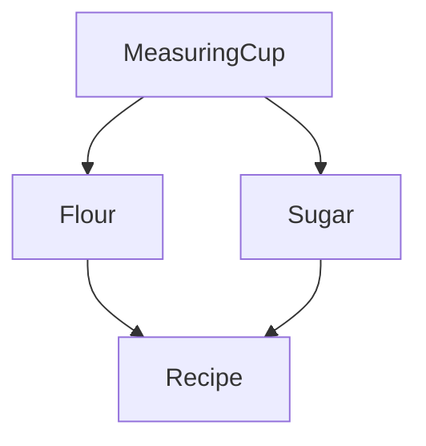

<style>
code.language-typescript {
  font-size:  1em;
  line-height: 1.5em;
}
</style>


# Effect

### Next-Generation Typescript

notes:
Hi, I'm Ethan and this video is an introduction to 'Effect', a typescript library to help developers easily create the complex applications of today and tomorrow.

We are stuck with javascript (and all of its quirks) whether we like it or not,
typescript has been a really big step, but the primatives its built on are still fundamentally flawed. it's time to build with a library designed to handle the complexity of modern development

---

How often have you seen this kind of code?

```ts
async function getData(): Data {
  const response = await fetch("https://api.example.com/foo");
  const json = await response.json();
  return dataSchema.parse(json);
}
```

What problems are there here?

notes:
How often have you seen this kind of code?
What problems might there be here?
The biggest problem is that this function could crash your program, but doesn't feel the need to tell you

---

```ts [2|3|4]
async function getData(): Data {
  const response = await fetch("...");
  const json = await response.json();
  return dataSchema.parse(json);
}
```

1.  `fetch` can reject
2.  `json` can reject
3.  `parse` can throw
4.  each of these is a different kind of error that may be handled differently

notes:
Unsafe assumptions crash our programs at runtime and wake us up at 4am.

---

<!-- ```tsx
let data: Data;
try {
  data = await getData();
} catch (error: unknown) {
  switch (error) {
	  /* ... */
  }
}
``` -->
<pre>
<code class="language-typescript">let data: Data;
try {
  data = await getData();
} catch (error: unknown) {
  switch (error) {
	  /* ... */
  }
}</code></pre>

How sure are you that you won't forget to catch

notes:
handling these cases properly in vanilla typescript is less than ideal. what if you forget to try/catch? what if you forget one of the possible errors?

---

<!-- ```tsx
function getData(): Effect.Effect<never, never, Data> {
  return pipe(
    Effect.tryPromise(() => fetch("https://api.example.com/foo")),
    Effect.orDie,
    Effect.flatMap((res) => Effect.tryPromise(() => res.json())),
    Effect.orDie,
    Effect.map((json) => Effect.try(() => dataSchema.parse(json))),
    Effect.orDie
  );
}
``` -->
<pre>
<code class="language-typescript">function getData(): Effect.Effect&lt;never, never, Data&gt; {
  return pipe(
    Effect.tryPromise(() =&gt; fetch("https://api.example.com/foo")),
    Effect.orDie,
    Effect.flatMap((res) =&gt; Effect.tryPromise(() =&gt; res.json())),
    Effect.orDie,
    Effect.map((json) =&gt; Effect.try(() =&gt; dataSchema.parse(json))),
    Effect.orDie
  );
}</code></pre>

Note the `orDie()s`.

notes:
This is exactly as unsafe as the original function, but the three places it can crash are now explicitly stated.
If you want it to never crash, you find alternatives for those .orDie()s

Here's an verbose version of what that might look like

---

A verbose Effect solution

<!-- ```ts
function getData(): Effect.Effect<
  never,
  FetchError | JSONError | ParseError,
  Data
> {
  return pipe(
    Effect.tryPromise({
      try: () => fetch("https://api.example.com/foo"),
      catch: () => new FetchError(),
    }),
    Effect.flatMap((res) =>
      Effect.tryPromise({
        try: () => res.json(),
        catch: () => new JSONError(),
      })
    ),
    Effect.flatMap((json) =>
      Effect.try({
        try: () => dataSchema.parse(json),
        catch: () => new ParseError(),
      })
    )
  );
}
``` -->
<pre>
<code style="font-size:  .75em; line-height: 1em;" class="language-typescript big-example">function getData(): Effect.Effect&lt;never, FetchError | JSONError | ParseError, Data&gt; {
  return pipe(
    Effect.tryPromise({
      try: () => fetch("https://api.example.com/foo"),
      catch: () => new FetchError(),
    }),
    Effect.flatMap((res) =&gt;
      Effect.tryPromise({
        try: () => res.json(),
        catch: () => new JSONError(),
      })
    ),
    Effect.flatMap((json) =&gt;
      Effect.try({
        try: () => dataSchema.parse(json),
        catch: () => new ParseError(),
      })
    )
  );
}</code></pre>

notes:
I know this may seem like a lot, but this is mostly caused by having to work around existing apis that are designed around try/catch.

It takes a bit of work at the weeds, but once your into the Effect world things become much easier

---

An idiomatic Effect solution

<!-- ```tsx
function getData(): Effect.Effect<
  never,
  FetchError | JSONError | ParseError,
  Data
> {
  return pipe(
    fetchDataToEffect(),
    Effect.flatMap((rawData) => dataSchema.parseToEither(rawData))
  );
}
``` -->
<pre>
<code class="language-typescript">function getData(): Effect.Effect&lt;
  never,
  FetchError | JSONError | ParseError,
  Data
&gt; {
  return pipe(
    fetchDataToEffect(),
    Effect.flatMap((rawData) =&gt; dataSchema.parseToEither(rawData))
  );
}</code></pre>

Errors automatically bubble up to form a separate 'happy' and 'error' path

notes:
An idiomatic Effect solution looks like this.
Don't worry too much about the specifics here.
We'll talk about basic Effect types and functions soon.

I just wanted to give you a taste.

---

## Problems today:

## 1. Javascript

notes:
The love/hate relationship with javascript is something most developers share, you can't seem to escape it. The language has grown a lot, with new modern features and typescript making development surprising pleasant. But the pain points are still there.

---

Effect brings typescript up another level, providing powerful primitives to make writing **safe**, **asynchronous**, **resourceful**, **composable**, **concurrent**, and **observable** programs easier than ever before.

---

## Isn't typescript already safe?

notes:
Lets start with type safety.

---

<!-- ```tsx
type SomeFn<T> = () => T;
``` -->
<pre>
<code class="language-typescript">type SomeFn&lt;T&gt; = () =&gt; T;</code></pre>

Could this function throw? If so, what is the type of the thrown error?

<!-- ```tsx
type SomeAsyncFn<T> = () => Promise<T>;
``` -->
<pre>
<code class="language-typescript">type SomeAsyncFn&lt;T&gt; = () =&gt; Promise&lt;T&gt;;</code></pre>

Could this promise reject? If so, what type is returned?

notes:
What's the problem with these two types? ...theyre only generic over one parameter

Typescript gives us the illusion of safety, but once things go off the happy path your left completely in the dark.

I am here to tell you that it doesn't have to be that way.

---

### The `Effect` Type

<!-- ```tsx
type Effect<Requirements, Error, Value> = (
  context: Requirements
) => Error | Value;
``` -->
<pre>
<code class="language-typescript">type Effect&lt;Requirements, Error, Value&gt; = (
  context: Requirements
) =&gt; Error | Value;</code></pre>

notes:
The Effect type is the core of the entire Effect ecosystem.

Although their actual implementation is more a bit complex than this, it can be helpful to think of `Effect` as a function that takes in its requirements as arguments and returns either a value or an error

---

Promises kind of suck...

notes:
Now back to javascript for a moment, 

Asynchronous code is everywhere in modern apps, but the `Promise` primitive leaves a lot to be desired

---

<!-- ```ts
const promiseWithImplicitMemoization = new Promise((resolve) => {
  console.log("Implicit memoization...");
  return resolve(1);
});
promiseWithImplicitMemoization.then(() => {
  console.log("First subscription");
  promiseWithImplicitMemoization.then(() => {
    console.log("Second subscription");
  });
});
``` -->
<pre>
<code class="language-typescript">const promiseWithImplicitMemoization = new Promise((resolve) =&gt; {
  console.log("Implicit memoization...");
  return resolve(1);
});
promiseWithImplicitMemoization.then(() =&gt; {
  console.log("First subscription");
  promiseWithImplicitMemoization.then(() =&gt; {
    console.log("Second subscription");
  });
});</code></pre>

Can you guess what will be printed?


notes:
- Promises are Eagerly executed, meaning they begin execution immediately on creation. This means they can never be used to represent a computation, only an already running computation that might have already completed and produced a value.
- Also, the value produced by a Promise is implicitly memoized, meaning that when the Promise is settled, the internal state of the Promise is frozen and can't be changed anymore, whether the Promise is fulfilled or rejected. Consequently if you want to run the same computation again, you'll need to recreate the entire Promise from scratch.

---

An `Effect` is a description of a program

<!-- ```tsx
// Effect<never, never, number>
const program = Effect.sync(() => {
  console.log("Hello, World!");
  return 1;
});
const output =  Effect.runSync(program); // console: "Hello, World!", output === 1
``` -->
<pre>
<code class="language-typescript">// Effect&lt;never, never, number&gt;
const program = Effect.sync(() =&gt; {
  console.log("Hello, World!");
  return 1;
});
// console: &lt;blank&gt;
const output = Effect.runSync(program); 
// console: "Hello, World!", output === 1</code></pre>

notes:
Effects arent like this

The `Effect` data type represents an **immutable** value that **lazily** describes a workflow or job, and all Effect functions produce new `Effect` values.

`Effect` values do not actually do anything, they are just values that model or describe effectful interactions.

An `Effect` can be interpreted by the Effect Runtime System into effectful interactions with the external world.

---

## `Effect` enables incredible things

notes:
If your like me, your mind is probably racing with possibilities this point. I am now going to give you a intentionally very quick tour of some of the things that the Effect ecosystem offers. Although your more than welcome to pause on each slide to try and understand what's going on, don't get too caught up in the specifics, I'll go into more depth in future videos. Just try to get an idea of what's possible.

---

## Error handling

<!-- ```js
// Effect<never, BazError, string>
const recovered = pipe(
  program, // Effect<never, FooError | BarError | BazError, string>
  Effect.catchTag("FooError", (fooError) =>
    Effect.succeed("Recovering from FooError")
  ),
  Effect.catchTag("BarError", (barError) =>
    Effect.succeed("Recovering from BarError")
  )
);
``` -->
<pre>
<code class="language-typescript">// Effect&lt;never, BazError, string&gt;
const recovered = pipe(
  program, // Effect&lt;never, FooError | BarError | BazError, string&gt;
  Effect.catchTag("FooError", (fooError) =&gt;
    Effect.succeed("Recovering from FooError")
  ),
  Effect.catchTag("BarError", (barError) =&gt;
    Effect.succeed("Recovering from BarError")
  )
);</code></pre>

notes:
now that errors are in their own dedicated channel and clearly separated by type it becomes trivial to handle errors case by case, all at once, or to let them bubble up to the next effect

---

## Dependecy Injection

<!-- ```tsx
async function getUserFromDB(userId: number) {
  return await db.user.getById(userId);
}
``` -->
<pre>
<code class="language-typescript">async function getUserFromDB(userId: number) {
  return await db.user.getById(userId);
}</code></pre>

notes:
Whats wrong with this snippet?

Well nothing, until you want to swap your live database client for a local test one.

Sure we could go full pure functional programming and pass every possible dependency as an argument, but that quickly becomes unrealistic

Effect provides a better way

---

Dependency Injection

<!-- ```tsx
type DBClient = {
  user: { getById(userId: number): User };
};
const DBClient = Context.Tag<DBClient>();

// returns Effect.Effect<DBClient, never, User>
function getUserFromDB(userId: number) {
  return pipe(
    DBClient,
    Effect.map((db) => db.user.getById(userId))
  );
}

// returns Effect.Effect<never, never, User>
const runnable = pipe(
	getUserFromDB,
	Effect.provideService(DBClient, actualDatabase)
)
``` -->
<pre>
<code style="line-height: 1em; font-size: .9em;" class="language-typescript">type DBClient = {
  user: { getById(userId: number): User };
};
const DBClient = Context.Tag&lt;DBClient&gt;();

// returns Effect.Effect&lt;DBClient, never, User&gt;
function getUserFromDB(userId: number) {
  return pipe(
    DBClient,
    Effect.map((db) =&gt; db.user.getById(userId))
  );
}
// Effect.Effect&lt;never, never, User&gt;
const runnable = pipe(
	getUserFromDB(1),
	Effect.provideService(DBClient, liveOrLocalDB)
)</code></pre>

notes:

In effect, a `Tag` is a placeholder for a dependency of some type. We can use the Tag just as if it was the actual implemented object in our Effects without ever actually implementing it. Doing so causes that type to appear in the `Requirements` field of the resulting effect.

This tells the effect runtime that you must provide a implementation that matches the defined type before the program can be run. This can be done flexibly anywhere in your program, meaning it becomes simple to swap out the implementation of a dependency when required.

---

## Dependency Dependencies



<!-- ```tsx
type ReceipeImplementation = Layer<Flour | Sugar, TimingError, Recipe>;
``` -->
<pre>
<code style="font-size: .95em"class="language-typescript">type ReceipeImplementation = Layer&lt;Flour | Sugar, TimingError, Recipe&gt;;</code></pre>

notes:
Modern apps are complex, often involving complex Dependency hierarchies. To account for this Effect provides `Layer` a type describing the blueprint for the construction of a set of requirements. It takes some requirements in, may produce some error, and yields some requirements out.

---

## Resource Management

<!-- ```tsx
// Effect<Scope, DBConnectionError, DataBase>
const database = Effect.acquireRelease({
  acquire: connectToDB,
  release: disconnectFromDB,
});
``` -->
<pre>
<code class="language-typescript">// Effect&lt;Scope, DBConnectionError, DataBase&gt;
const database = Effect.acquireRelease({
  acquire: connectToDB,
  release: disconnectFromDB,
});</code></pre>

notes:
Resources in our applications may require lifetime related logic.

The `Scope` data type is fundamental for managing resources safely and in a composable manner in Effect.

In simple terms, a scope represents the lifetime of one or more resources. When a scope is closed, the resources associated with it are guaranteed to be released.

---

## Logging

<!-- ```tsx
const program = Effect.log("Application started");
Effect.runSync(program);
/*Output:timestamp=2023-07-05T09:14:53.275Z level=INFO
fiber=#0 message="Application started"*/
``` -->
<pre>
<code class="language-typescript">const program = Effect.log("Application started");
Effect.runSync(program);
/*Output:timestamp=2023-07-05T09:14:53.275Z level=INFO
fiber=#0 message="Application started"*/</code></pre>

notes:
Modern applications require observability for us to know what is going on within them.

Effect provides powerful logging capabilities, with different levels such as debug, info, warning and error, as well as the able to provide a custom logger that can do more than just a simple console.log.

---

### Resilience on Failures

<!-- ```ts
const schedule = pipe(
  Schedule.exponential(Duration.millis(10)),
  Schedule.jittered,
  Schedule.whileOutput((n) => Duration.lessThan(n, Duration.millis(100)))
);
Effect.runPromise(Effect.repeat(logDelay, schedule));
/*
delay: 3
delay: 18
delay: 24
delay: 48
delay: 92
*/
``` -->
<pre>
<code style="line-height: 1em; font-size:.95em"class="language-typescript">const schedule = pipe(
  Schedule.exponential(Duration.millis(10)),
  Schedule.jittered,
  Schedule.whileOutput((n) =&gt; Duration.lessThan(n, Duration.millis(100)))
);
Effect.runPromise(Effect.repeat(logDelay, schedule));
/*
delay: 3
delay: 18
delay: 24
delay: 48
delay: 92
*/</code></pre>

notes:

Effect provides a powerful, composable scheduling toolkit for when you want to run an Effect more than just once

Have you ever tried implementing jittered exponential backoff?

If you were to try to implement this snippet without effect, how would you do it? Would it be as flexible or maintainable?

---

### Concurrency

<!-- ```tsx
const promises = userIds.map(fetchUser);
const users = Promise.all(promises);
``` -->
<pre>
<code class="language-typescript">const promises = userIds.map(fetchUser);
const users = Promise.all(promises);</code></pre>

notes:
This code works while your meager startup only has 5 users, but what about when it grows to hundreds or thousands. That many requests at once will crash your users' devices. and remember promises, are eagerly executed so we'll need to design a complicated async queue with batching and interruption to enforce a level of parallelism

or we could use effect

---

## Controlled Concurrency

<!-- ```tsx
const users = pipe(
  Effect.all(userIds.map(fetchUserEffect), {
    concurrency: 10,
  })
);
``` -->
<pre>
<code class="language-typescript">const users = pipe(
  Effect.all(userIds.map(fetchUserEffect), {
    concurrency: 10,
  })
);</code></pre>

notes:

It really is this easy. Effects `fiber` based runtime manages everything for you.

---

### Fibers + Interruption

<!-- ```tsx
const program = pipe(
  Effect.log("start"),
  Effect.flatMap(() => Effect.sleep(Duration.seconds(2))),
  Effect.flatMap(() => Effect.interrupt()),
  Effect.flatMap(() => Effect.logInfo("done"))
);
Effect.runPromise(program).catch((error) =>
  console.log(`interrupted: ${error}`)
);
// timestamp=...885Z level=INFO fiber=#0 message=start
// interrupted: All fibers interrupted without errors.
``` -->
<pre>
<code class="language-typescript">const program = pipe(
  Effect.log("start"),
  Effect.flatMap(() =&gt; Effect.sleep(Duration.seconds(2))),
  Effect.flatMap(() =&gt; Effect.interrupt()),
  Effect.flatMap(() =&gt; Effect.logInfo("done"))
);
Effect.runPromise(program).catch((error) =&gt;
  console.log(`interrupted: ${error}`)
);
// timestamp=...885Z level=INFO fiber=#0 message=start
// interrupted: All fibers interrupted without errors.</code></pre>

notes:
Lightweight threads of execution called `fibers` power effects runtime. Think of a fiber as a worker that performs a specific job. It can be started, paused, resumed, and even interrupted.

Effect also seamlessly integrates with existing interruption APIs such as AbortController

Working with Fibers directly is an advanced usecase you probably wont need for a while when starting out

---

### The Ecosystem is Massive

- ...Everything already mentioned
- Configuration
- Metrics
- Schema Validation
- Custom Data Structures
- Pattern Matching
- Caching + Batching
- ... SO MUCH MORE

notes:
Application code in TypeScript often solves the same problems over and over again.  Effect provides a rich ecosystem of libraries that provide standardized solutions to many of these problems. You can use these libraries to build your application, or you can use them to build your own libraries.

However, effect understands its not always realistic to rewrite your entire application...

---

### Effect is fully interoperable with existing code

notes:
By now you might have thought back to other projects aimed at 'doing typescript better', or even other programming languages, the majority of which ultimately fall to the same fate, a lack of easy interop with the vast and unavoidable existing javascript ecosystem

Not Effect. While it would be awesome to write applications that are 'Effect all the way down', you can just start with the pieces of the ecosystem that make the most sense for the problems you are solving.

Do you just want to rewrite a single endpoint that does some complicated parallel async work, or has some particularly nasty error handling? You can do it with Effect today.

Do you just want to take advantage of one of Effects useful data structures? You can do it with Effect today.

However, as more and more of your codebase is using Effect, you will probably find yourself wanting to utilize more of the ecosystem!

---

### Generators

<!-- ```ts
async function program() {
  const [a, b] = await Promise.all([Promise.resolve(10), Promise.resolve(2)]);
  const n1 = await divide(a, b);
  const n2 = increment(n1);
  return `Result is: ${n2}`;
}

console.log(await program()); // Output: "Result is: 6"

const program = Effect.gen(function* (_) {
  const [a, b] = yield* _(Effect.all(Effect.succeed(10), Effect.succeed(2)));
  const n1 = yield* _(divide(a, b));
  const n2 = increment(n1);
  return `Result is: ${n2}`;
});

console.log(Effect.runSync(program)); // Output: "Result is: 6"
``` -->
<pre>
<code style="font-size:  .88em; line-height: 1em;" class="language-typescript">async function program() {
  const [a, b] = await Promise.all([Promise.resolve(10), Promise.resolve(2)]);
  const n1 = await divide(a, b);
  const n2 = increment(n1);
  return `Result is: ${n2}`;
}

console.log(await program()); // Output: "Result is: 6"

const program = Effect.gen(function* (_) {
  const [a, b] = yield* _(Effect.all([Effect.succeed(10), Effect.succeed(2)]));
  const n1 = yield* _(divide(a, b));
  const n2 = increment(n1);
  return `Result is: ${n2}`;
});

console.log(Effect.runSync(program)); // Output: "Result is: 6"</code></pre>

notes:
And lastly, if you think you could get out of using Effect because 'functional programming is too different and too difficult', think again. Effect has its own form of 'async-await' style syntax powered by generators. With generators you can write effectful code in the imperative way that you already know.

---


# Effect

### Next-Generation Typescript

notes:

Effect's concepts may be new to you, and might not completely make sense at first. This is totally normal. 

Learning Effect is a lot of fun. Many developers in the Effect ecosystem are using Effect today to solve real problems in their day-to-day work, as well as experimenting with cutting edge ideas for pushing TypeScript to be the most useful language it can be.

I hope you feel inspired to give the Effect documentation a read, and to explore the Effect repositories and API Reference pages.

Consider joining the Effect discord server, a great community for learning and discussing effect.

Links to all of that as well as the transcript and markdown sourcecode to this video are available in the description

And corrections will be in the pinned comment.

Finally a big thank you and shoutout to no boilerplate, to whom this video takes very strong inspiration from.

His videos are incredible and inspired my passion for rust, just like I hope this video will inspire your passion for Effect.

Please check out his channel link also in the description.

Thank you so much for watching, and I'll see you next time.

---
