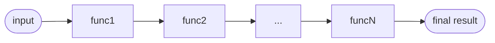

<style>
code.language-typescript {
  font-size:  1em;
  line-height: 1.5em;
}
</style>
<script src="./attachments/me.js"></script>

![[effect-logo.png]]
## Effect
Is it "TypeScript"?

notes:
Effect is a typescript library, but introduces concepts and apis brand new to most typescript developers. So, is it 'typescript'?

---

*"Effect is too different and complex"*

notes:
What do I mean by this? Some of the initial reactions I see to Effect are concerned about Effect's patterns being too distant from 'normal vanilla' typescript, and in some ways, they're correct.

Effect is something new, a new way to solve our long existing problems with javascript and typescript.

---

```ts
function fn(): number throws Error { ... }
```
![[throws-issue-closed.png]]
notes:
A typescript pr back from 2016 asking for functions to be able to declare what they throw was recently closed by the typescript team.

why? well the ts team said
- currently, Existing libraries tend to not declaring what errors they throw in their documentation, let alone their types
- using `instanceof` in catch is fine

but think about even if this got merged, would this still be the typescript we wanted?
a language fundamentally based around try catch with untyped error?
a language built around a flawed async primitive, promise?

---
## You can do a lot with TypeScript

notes:

For all of its flaws, TypeScript has a lot going for it. It's type system punches far above its weight, while the underlying javascript is still hacky enough to enable really neat features for library authors that know what they are doing.

Effect embraces typescript for what it is, while pushing it to do the absolute most possible through new apis.

---

## Effect is just TypeScript

notes:

Effect brings the best features of other languages, typed errors and managed side effects (along with a powerful ecosystem around them) to pure native typescript

I say this in that Effect introduces zero new syntax. It requires zero transpilation or compliation step. 
you just npm install and run however you did before. This is important and intentional.

---

## Effect isn't *like* "TypeScript"

notes:

But obviously Effect is also not exactly traditional ‘typescript’: traditional typescript throws and runs side effects eagerly, where Effect provides different  tools

This level of additional functionality over traditional typescript isnt free, it can't be. The implementation of new features has to happen somewhere.

and its true that this means that your code may look slightly different, and a new dev may have a 'ramp-up' time before feeling comfortable

add its also true, that this means in basic examples traditional code might be simpler or shorter

but we arent building simple apps

---

Were here to build things that scale

notes:

Today, TypeScript is a language used to build full stack app applications that serve millions of users.

At this scale, you can not escape complexity, only manage it.

The time this takes you and your team to learn and adopt Effect is far less than the cost of trying to do things the flawed traditional way, or designing an inferior abstraction yourself

and all things considered, Effect isnt that bad to pick up

---

Effect is for the common dev

notes:
Effect is designed to be as approachable as possible for the common developer. It balances purity from the functional world with practicality and familiarity.

The Effect documentation does a great job at explaining Effect's possibly new concepts. Although the Effect docs are no where near complete, I can assure you the Effect  team is working hard to improve them. There’s still a lot to cover but what's there right now is very high-quality and more than enough to get started.

---

![[monad-MIA.jpg|600]]

notes:

Something youll notice when reading the Effect docs is a surprising absence of the abstract terminlogy usually associated with functional programming.

Search for "monad", "functor" or "applicative" and youll find they are nowhere to be found.

These and other functional programming concepts are powerful, and drive effect underneath all the abstraction, but Effect is designed so that the apis it provides are easy to understand and use without a phd.

---

Why
```ts
import * as Effect from '@effect/io/Effect';
const foo = Effect.all([foo, bar]).pipe(
  Effect.flatMap(([a, b]) => divide(a, b)),
  Effect.map((n1) => increment(n1)),
  Effect.map((n2) => `Result is: ${n2}`)
)
```
and not
```ts
import { Effect } from '@effect/io/Effect';
const foo = Effect.all([foo, bar])
  .flatMap(([a, b]) => divide(a, b))
  .map((n1) => increment(n1))
  .map((n2) => `Result is: ${n2}`);
```

notes:
The two things you are likely to immediately notice about Effect code is the use of namespaced imports and `pipe`

these may be slightly different to patterns you used to, but give me a chance to explain them

---

```rust
struct Foo;

impl Foo {
    fn bar(self) {}
}

fn main() {
    let x = Foo;
    Foo::bar(x);
    let x = Foo;
    x.bar();
}
```

These two calls to `foo` are identical

notes:
Whether your following a functional or object oriented paradigm, most of code in theory is the same. A series of transformers to some data. Here in rust, a method and a function that takes the data as its first argument are completely identical and compile to the exact same assembly, and if you don't use a certain method it gets compiled away and never makes it to the final binary.

---

```ts
class Foo {
	bar() {}
}

let x = new Foo();
x.bar();
Foo.prototype.bar.call(x);
```

```ts
function bar(self: Foo) {}
bar(x);
```

These are different

notes:
But back in javascript things are quite different. When we create a method on a class that method exists on the prototype chain for every instance of that class, even if its never used. 

---

```ts
// Foo.ts
function bar(self: Foo) {}

// index.ts
import * as Foo from './Foo.ts'
let x = new Foo();
Foo.bar(x);
pipe(x, Foo.bar);
```

notes:
The apis in Effect are pretty big. @effect/io/Effect has over 300 functions. In reality though you'll probably only use 10-20 consistently in most code. But what about all those other unused functions? If they were all under one class it would be impossible for a bundler to tree shake them.

Thats why Effect uses namespace imports. each effect module consists of a bunch of top level functions, if you dont use one, your bundler will throw it away at build time.

---
Massive Bundle:
```ts
import { Effect } from '@effect/io/Effect';
const foo = Effect.all([foo, bar])
  .flatMap(([a, b]) => divide(a, b))
  .map((n1) => increment(n1))
  .map((n2) => `Result is: ${n2}`);
```

Tree Shaken:

```ts
import * as Effect from '@effect/io/Effect';
const baz = Effect.all([foo, bar]).pipe(
  Effect.flatMap(([a, b]) => divide(a, b)),
  Effect.map((n1) => increment(n1)),
  Effect.map((n2) => `Result is: ${n2}`)
)
```
notes:
And with pipe the code comes out looking pretty similar to a traditional chained method approach.

---

`pipe`

```ts
const result = pipe(input, func1, func2, ..., funcN)
```


notes:
Pipe is a simple but powerful tool to chain successive operations. It takes a starting piece of data and a series of functions. It starts by calling the first function with the input data, then calls the next function with the result of the previous function, and so on. It's important to note that functions passed to `pipe` must have a **single argument** because they are only called with a single argument, the result of the previous function.

---

```ts
const increment = (x: number) => x + 1
const double = (x: number) => x * 2
const subtractTen = (x: number) => x - 10
 
const result = pipe(5, increment, double, subtractTen)
// identical to subtractTen(double(increment(5)))
 
console.log(result) // Output: 2
```

notes:

Just like method chaining, this makes it easy to view a left to right or top to bottom series of transformations while avoiding hard to read nested function calls.

---
```ts
Effect.map(myEffect, data => data + 1)
```

notes:
In Effect you can use every function in two ways.

The first way is by passing the "data", or main input the function is acting on, as the first argument. This is most convenient when just calling a single function. 

---
```ts
pipe(
  myEffect,
  (effect) => Effect.map(effect, data => data+1)
)
```
This is a bit annoying

notes:
but if this was the only option, when using a pipeline youd have to use a anonymous wrapper function which can get annoying

---

```ts
Effect.map(data => data + 1)(myEffect)
```
```ts
pipe(
  myEffect,
  Effect.map(data => data+1)
)
```

notes:
This leads us to the second way to call functions. Leaving out the "data" from the original function call will cause it to return another function that takes the data as its only argument. This method is perfect for use in pipe lines when chaining multiple operations.

---

## Different is good

notes:
Throughout your Effect journey you will continue to see new patterns such as these.

If you are familiar with Rust, you know that it was not afraid to completely re-imagine memory management for a low level language to achieve the safety desired. 

Similarly, Effect is not afraid to challenge the status quo of programming in TypeScript.

If some parts are unfamiliar, that's kind of the point. TypeScript is flawed and if we want things to be different, our code will need to look different too.

---

## *but*, compatibility is also good

notes:
Effect provides these new patterns while remaining a pure typescript library ready to sit side-by-side with your existing code.

---
![[cory-house-tweet-1.png]]
notes:
While attempting to write the conclusion for this video I came across this tweet from Cory House which put things better than I could. The tweet is about the transition from javascript to typescript

---
![[edit-tweet-1.png]]
notes:
but the argument is the exact same for going from vanilla typescript to Effect

---

![[cory-house-tweet-2.png]]

notes:
Cory correctly points out that many initial complaints about TypeScript were misplaced. It does make your code slightly more verbose and complex in some places, but the complexity it **prevents** in other places is exponentially bigger.

---
![[edit-tweet-2.png]]

notes:
Effect does the exact same thing but now on an additional level to what vanilla typescript provides, with as few compromises as possible.

---

## Effect is *better* TypeScript

notes:

Effect is the typescript I wish we always had, and hopefully soon you will too.

The transcript and markdown sourcecode to this video are available on my github, link in the description, and corrections will be in the pinned comment.

Thank you so much for watching, and I'll see you next time.
